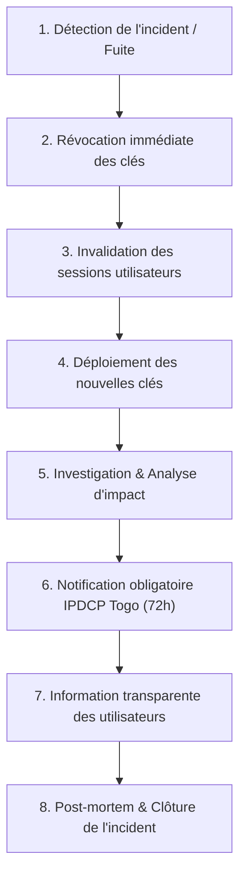

# POLITIQUE DE SÉCURITÉ & PLAN DE RÉPONSE AUX INCIDENTS — NYEGA

Ce document définit la politique de sécurité du projet **NyeGa**, la checklist obligatoire avant tout déploiement en production, ainsi que la procédure opérationnelle d'urgence à suivre en cas de fuite de données ou de compromission de clés.

---

## 1. CHECKLIST DE MISE EN PRODUCTION (PRE-FLIGHT CHECKLIST)

Avant tout déploiement sur domaine de production (ex. `https://nyega.tg` ou `https://nyega.app`), vérifiez scrupuleusement les 10 points suivants :

- [ ] **1. Row Level Security (RLS) active sur 100% des tables**
  - Vérifier que `ALTER TABLE ... ENABLE ROW LEVEL SECURITY;` a été exécuté sur `profiles`, `categories`, `category_rules`, `budgets`, `expenses`, et `rate_limits`.
  - Exécuter le script de validation `tests/rls_isolation_test.sql` pour prouver l'isolation hermétique entre étudiants.
  - S'assurer que la table `rate_limits` a tous ses droits directs révoqués pour `anon` et `authenticated`.

- [ ] **2. Séparation stricte des clés Supabase**
  - **Dans le frontend (`js/config.js`) :** Uniquement la clé publique `SUPABASE_ANON_KEY` et `SUPABASE_URL`.
  - **Côté serveur :** La clé secrète `SUPABASE_SERVICE_ROLE_KEY` ne doit **JAMAIS** figurer dans le code source client ni dans un commit Git. Elle est injectée uniquement dans l'environnement de l'Edge Function.
  - La clé `GEMINI_API_KEY` doit être injectée uniquement via `supabase secrets set GEMINI_API_KEY="..."`.

- [ ] **3. Fichiers sensibles et Git**
  - Vérifier que le fichier `.gitignore` est présent à la racine et ignore `.env`, `.env.*`, `supabase/.env*`, et `node_modules/`.
  - S'assurer qu'aucun fichier `.env` réel contenant des secrets de production n'a été commité dans l'historique Git (`git log -S "secret"`).

- [ ] **4. En-têtes de sécurité HTTP & Content-Security-Policy (CSP)**
  - Confirmer que `_headers`, `netlify.toml` ou `vercel.json` sont pris en compte par votre plateforme d'hébergement.
  - Vérifier la présence de :
    - `Content-Security-Policy` stricte (scripts limités à l'origine et aux CDN officiels Supabase/Chart.js).
    - `X-Content-Type-Options: nosniff`
    - `X-Frame-Options: DENY` (protection anti-clickjacking)
    - `Referrer-Policy: strict-origin-when-cross-origin`
    - `Strict-Transport-Security: max-age=31536000; includeSubDomains`

- [ ] **5. Politique de mots de passe & Anti-énumération**
  - Longueur minimale de 8 caractères imposée à la fois dans l'interface (`minlength="8"`) et dans la validation JS.
  - Messages d'erreur d'authentification génériques empêchant la détection d'existence d'adresses email.
  - Déconnexion totale purgeant `localStorage.clear()` et `sessionStorage.clear()`.

- [ ] **6. Edge Function de Catégorisation IA**
  - Validation stricte des entrées : type JSON, description textuelle assainie de 1 à 100 caractères maximum.
  - En-tête CORS restreint aux domaines officiels de l'application (pas de wildcard `*` sans restriction).
  - Quota de limitation de débit atomique fixé à 30 requêtes/heure par étudiant.
  - Absence absolue de données nominatives (email, nom, mot-clé, PII) dans les logs serveur.

- [ ] **7. Conformité réglementaire togolaise (Loi 2019-014)**
  - Liens vers la **Politique de Confidentialité** et les **Conditions Générales d'Utilisation** accessibles sur les écrans d'authentification et de gestion.
  - Personnalisation des champs `[À COMPLÉTER]` (identité de l'éditeur, adresse à Lomé, contact).
  - Bouton **« Exporter mes dépenses (CSV) »** fonctionnel (Droit à la portabilité).
  - Bouton **« Supprimer mon compte »** fonctionnel avec confirmation explicite (Droit à l'effacement).

- [ ] **8. URL de redirection Supabase Auth**
  - Dans la console Supabase (Authentication > URL Configuration) :
    - Remplacer `localhost` par le domaine réel de production `https://nyega.tg/nyega-web/auth.html`.
    - Définir les Redirect URLs autorisées pour la récupération de mot de passe (`#reset-password`).

- [ ] **9. Certificat SSL/TLS**
  - Forcer la redirection systématique HTTPS (HSTS actif, note A+ sur SSL Labs).

- [ ] **10. Sauvegardes de la base de données**
  - Activer les sauvegardes quotidiennes automatiques (Point-in-Time Recovery ou pg_dump) sur le projet Supabase.

---

## 2. PROCÉDURE EN CAS DE FUITE DE DONNÉES OU COMPROMISSION DE CLÉS

En cas de suspicion ou de confirmation de fuite de clé API, de clé de service ou d'exfiltration de données, appliquez **immédiatement** la procédure d'urgence ci-dessous :



### ÉTAPE 1 : Révocation immédiate des secrets compromis (Délai : < 15 minutes)

#### A. Si la clé `SUPABASE_SERVICE_ROLE_KEY` ou `JWT_SECRET` a fuité :
1. Connectez-vous à la [Console Supabase](https://app.supabase.com) > **Project Settings** > **API**.
2. Dans la section **JWT Settings**, cliquez sur **« Generate new secret »** (ou contactez le support Supabase pour un Roll API Keys d'urgence).
   > **Impact immédiat :** Toutes les clés `anon` et `service_role` existantes deviennent instantanément caduques. Toutes les sessions utilisateurs pirates sont invalidées.
3. Copiez la nouvelle `anon key` et la nouvelle `service_role key`.

#### B. Si la clé `GEMINI_API_KEY` a fuité :
1. Rendez-vous sur [Google Cloud Console / Google AI Studio](https://aistudio.google.com/app/apikey).
2. Supprimez immédiatement la clé compromise.
3. Générez une nouvelle clé d'API restreinte au modèle utilisé (`gemini-3.1-flash-lite`).
4. Mettez à jour le secret dans Supabase Edge Function :
   ```bash
   supabase secrets set GEMINI_API_KEY="AIzaSyNouvelleCleSecurisee..."
   ```

### ÉTAPE 2 : Invalidation globale des sessions utilisateur
Dans l'Éditeur SQL Supabase, exécutez la commande d'invalidation de toutes les sessions actives :
```sql
-- Déconnexion forcée de l'ensemble des sessions existantes
UPDATE auth.users
SET raw_app_meta_data = raw_app_meta_data || '{"revoked_at": "' || NOW() || '"}'::jsonb;
```

### ÉTAPE 3 : Déploiement des nouveaux secrets
1. Mettez à jour `nyega-web/js/config.js` avec la nouvelle clé `anon` publique.
2. Mettez à jour les variables d'environnement de déploiement (sur Vercel, Netlify ou votre serveur).
3. Redéployez l'application web immédiatement.

### ÉTAPE 4 : Investigation technique
1. Consultez les logs Supabase (**Database Logs**, **API Logs**, **Edge Function Logs**).
2. Déterminez :
   - La source de la fuite (dépôt Git public, journal d'erreur, poste de travail infecté).
   - Les adresses IP ayant utilisé la clé compromise.
   - Les tables et volumes de données potentiellement consultés ou modifiés.

### ÉTAPE 5 : Notifications légales obligatoires (Loi 2019-014 Togo)

Conformément à l'Article 43 de la **Loi n° 2019-014 du Togo**, le responsable du traitement a l'obligation légale de notifier toute violation de données à caractère personnel :

#### 1. Notification à l'Autorité de contrôle (IPDCP)
- **Destinataire :** **Instance de Protection des Données à Caractère Personnel (IPDCP)** de la République Togolaise.
- **Délai légal :** Au plus tard **72 heures** après en avoir pris connaissance.
- **Contenu du rapport d'incident :**
  - Nature de la violation (accès non autorisé, fuite de clé).
  - Catégories et nombre approximatif d'utilisateurs concernés.
  - Conséquences probables de la violation.
  - Mesures prises ou envisagées pour remédier à la violation et atténuer les risques.
  - Coordonnées du DPO ou point de contact.

#### 2. Notification aux utilisateurs (Étudiants)
Si la violation est susceptible d'engendrer un risque élevé pour les droits et libertés des utilisateurs :
- Envoyer un email d'information clair et compréhensible à tous les utilisateurs concernés.
- Les inviter à réinitialiser leur mot de passe via l'écran *« Mot de passe oublié ? »*.
- Rappeler qu'aucun mot de passe en clair ni coordonnée bancaire n'était stocké.

---

## 3. CONTACT & SIGNALEMENT DE VULNÉRABILITÉS

Pour tout signalement de faille de sécurité ou de comportement anormal :
- **Email d'urgence sécurité :** `security@nyega.tg` *(ou [À COMPLÉTER : votre email personnel/pro])*
- **Délai de première réponse garanti :** Moins de 24 heures.
- **Engagement de divulgation responsable :** Aucune poursuite ne sera engagée contre les chercheurs en sécurité agissant de bonne foi dans le respect de nos systèmes et des données de nos utilisateurs.
